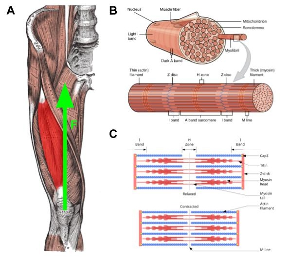
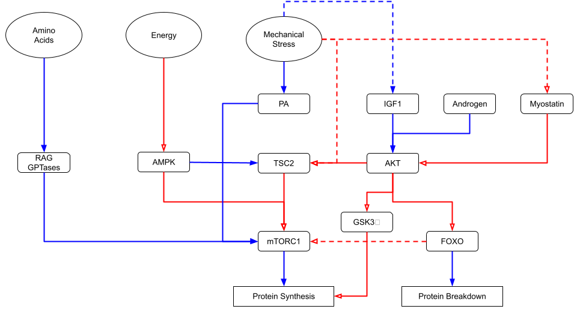
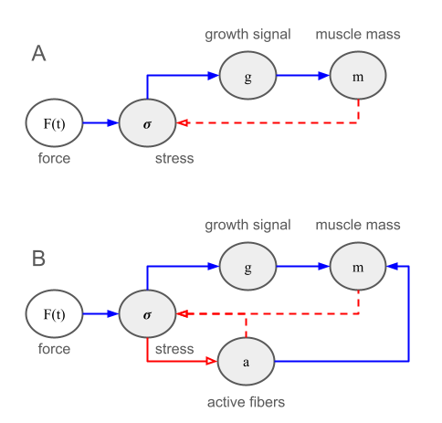

# Introduction

Skeletal muscle is the contractile tissue responsible for generating the forces that produce movement. 
Skeletal muscle also adapts to increasing demands for force production by building new contractile units
within muscle cells, causing the cells to grow larger via a process known as hypertrophy. However, muscle
tissue also adapts to this stimulus, and repeated application of the same stimulus does not drive additional
growth in muscle tissue. Continuing to grow muscle requires progressive overload in which the muscle is subjected
to increasing stress over time. In this post, I examine the mechanism driving the adaptation of muscle tissue 
to mechanical stress by developing a minimal mathematical model of stress induced hypertrophy that highlights 
connections to robust adaptation in other biological systems.  

## Organization of Muscle Tissue

Skeletal muscle is a post-mitotic tissue consisting of long, cylindrical cells called muscle fibers or myofibers. 
The following is a short overview of muscle physiology; see reviews [@frontera2015skeletal; @mukund2020skeletal] for more details. 
Each muscle fiber is a multinucleate cell that spans the length of the muscle, connecting via tendons to bones on
each end (Figure 1A). Note that a myofiber is not a protein filament, but rather a whole cell that is typically 
micrometers in diameter and centimeters in length, in contrast to a myofibril, which is a component within muscle 
cells. Muscle fibers are typically aligned nearly parallel to the axis of force generation; however, 
in general the angle between the muscle fiber and the axis of force generation is called the pennation angle. Some 
muscles -- such as the rectus femoris highlighted in Figure 1A -- consist of fibers with different pennation angles
(called bipennate or multipennate tissues) whereas others are unipennate and have fibers that run parallel to each 
other. For simplicity, I will develop the theory for unipennate, parallel muscle fibers with the understanding that
it can be readily generalized to other fiber orientations (e.g., by including a $\cos(\theta)$ term where necessary).

---

{fig-align="center" width="600"}

_Figure 1. Schematic of muscle structure, from (A) muscle tissue to (B) muscle fibers down to (C) individual sarcomeres. 
Muscle hypertrophy generally involves an increase in the number and size of myofibrils within each muscle fiber, 
primarily through net protein accretion and addition of new myofibrils as fibers grow. Embedded figures are from 
Wikipedia ([Rectus femoris](https://en.wikipedia.org/wiki/File:Rectus_femoris.png), 
[Organization of Muscle Fiber](https://en.wikipedia.org/wiki/File:1002_Organization_of_Muscle_Fiber.jpg), 
[Sarcomere](https://en.wikipedia.org/wiki/File:Sarcomere.svg))._

---

Muscle tissue is organized hierarchically. Muscle fibers (which are themselves grouped into fascicles) 
span the length of the tissue. Myofibrils are cylindrical structures within muscle fibers that span 
the length of the cell and are responsible for doing the actual mechanical work (Figure 1B). Myofibrils
are subsequently made up of repeating units called sarcomeres, which correspond to the individual
contractile units (Figure 1C). 

Each sarcomere -- typically 2–3 μm long at rest -- consists of overlapping thick filaments (made of myosin)
and thin filaments (made of actin), along with the elastic protein titin that acts as a molecular spring. Titin 
also connects the thick filaments to the structural boundary of the sarcomere, a protein lattice called the Z-disk 
primarily composed of α-actinin that transmits force to neighboring sarcomeres. During contraction, 
myosin heads repeatedly bind to actin, pull the thin filaments inward, and release, shortening the sarcomere as 
the filaments slide past one another (this myosin powerstroke is driven by ATP binding and hydrolysis).

Muscle fibers are innervated in groups called motor units, with each motor unit consisting of a single 
motor neuron controlling multiple fibers. The fibers within a motor unit contract completely, or not at all,
when stimulated. Thus, an individual motor unit only contracts if the stimulus exceeds a given threshold. Force 
output is graded by recruiting additional motor units, or by increasing the firing rate of already-active motor 
neurons. In addition, motor units are recruited sequentially, starting with fatigue-resistant slow twitch fibers 
first, with high-force producing fast-twitch fibers brought in as the demand for additional force production increases. 

Muscle tissue generally adapts to exercise or other stimuli in three ways. First, the cells may produce metabolic 
adaptations, such as additional mitochondria, in response to increased energy demands. Second, the motor neurons 
may adapt to repeated training, for example by increasing firing rates or synchronizing activity across motor units. 
Third, muscle cells may grow larger (i.e., hypertrophy) by producing additional contractile proteins. 

## Hypertrophy 

Because muscle tissue is post-mitotic, hyperplasia -- the growth of new muscle fibers -- does not 
generally happen under normal conditions. Instead, muscle growth involves growth in size of existing muscle fibers
-- particularly growth in the cross-sectional area, though growth in length can occur as well. 
Hypertrophy can occur due to an increase in the fluid inside muscle cells (sarcoplasmic hypertrophy) or due to 
the creation of new contractile units (myofibrillar hypertrophy). Sarcoplasmic hypertrophy may lead to improved 
endurance,  whereas myofibrillar hypertrophy leads to increased capacity for force production. From now on, 
whenever I use the term hypertrophy I am specfically referring to myofibrillar hypertrophy. 

Hypertrophy is driven by a net increase in myofibrillar protein, indicating that muscle protein
synthesis must exceed muscle protein degradation. There are a number of inputs that affect the 
rates of muscle protein synthesis and degradation both directly and indirectly including the 
availability of amino acids and energy, response to mechanical stress, and hormones such as IGF-1,
androgens, and myostatin. Like most things in systems biology, these inputs affect their responses though 
a complex web of biochemical interactions, partially illustrated in Figure 2. 

---

{fig-align="center" width="600"}

_Figure 2. A schematic view of the biochemical signaling cascades involved in hypertrophy. 
Ovals represent input nodes, rectangles output nodes, and rounded rectangles intermediate nodes.
Blue lines with solid arrowheads represent activation, whereas red lines with hollow arrowheads
represent inhibition. Secondary or indirect interactions are shown as dashed lines.
See [@bond2016regulation]._

---

The hypertrophic response to mechanical stress is primarily controlled by the activation of the mTORC1 complex, 
which goes on to activate muscle protein synthesis. This response is mediated by three different pathways. 
First, eccentric contractions lead to the hyperphosphorylation of TSC2 and subsequent translocation of TSC2 
away from the lysosome, preventing TSC2 from inhibiting mTORC1 [@jacobs2013eccentric]. Second, mechanical 
stimuli increase concentrations of phosphatidic acid (PA) — though, the precise cause of this is poorly 
understood [@bond2016regulation] — which directly activates mTORC1 [@yoon2011phosphatidic]. A third 
mechanism involves exercise induced increase of IGF-1, leading to activation of mTORC1 through the AKT pathway. 
The IGF-1 induced mechanism was once considered to be the dominant pathway regulating mechanical stress 
induced hypertrophy, but subsequent research has shown that the IGF-1/AKT pathway is not necessary 
[@spangenburg2008functional; @hornberger2011mechanotransduction; @miyazaki2011early] even though mTORC1 
activation is necessary [@you2018role]. Thus, current evidence suggests that the IGF-1/AKT pathway is only 
of secondary importance for the hypertrophic response to mechanical stimuli relative to the former pathways.

Whatever the upstream mechanism, the activation of mTORC1 upregulates ribosomal activity and drives
protein synthesis. As myofibrils accumulate protein they grow radially, and once they reach a sufficient 
size they split longitudinally, producing new myofibrils. So fiber growth is essentially an increase in 
the number of myofibrils packed into the fiber cross-section. Sarcomeres can also be added in series at 
the tips of myofibrils, increasing fiber length, though this is less dominant in the context of resistance 
training. Finally, muscle fibers are multinucleate cells because a myonucleus can only support a limited 
cytoplasmic volume, thus sustained hypertrophy is thought to require the incorporation of new nuclei, 
donated by satellite cells — resident stem cells that proliferate and fuse with the fiber in response to 
mechanical loading and local damage. However, the remaining of this post will focus only on the increase 
in muscle protein synthesis driven by mechanical stimuli. 

## Existing Models of Hypertrophy

# Theory 

Even though the details of the signaling networks leading to the hypertrophic response to mechanical stimulus 
are not entirely understood, it seems clear that mTORC1 activation -- via whatever upstream mechanism -- is the 
predominant signal for muscle growth. 

{fig-align="center" width="600"}

_Figure 3. Illustrations of two minimal models of mechanical stress induced hypertrophy. In (A), force 
causes mechanical stress that induces a growth signal (i.e., mTORC1 activation) amd drives muscle protein 
synthesis, which leads to a decrease in stress at the same force output. The model in (B) is similar, but 
also accounts for a stress induced decrease in the fraction of active muscle fibers due to accumulated damage._

## Hill Functions

We will be using the Hill function, so it is helpful to define some notation up front. The Hill function
$$
\phi_n(x; K) = \frac{x^n}{K^n + x^n} 
$$
is an example of a saturating function, where $K$ sets the scale at which $x$ starts to saturate and $n$
sets the steepness with which $\phi$ switches from near $0$ to near $1$ as $x$ crosses $K$. For the sake 
of simplicity, we will take $n=1$ for all of the Hill functions in the model presented below but the results
are easily generalizable. 

## Mechanical Stress

Muscle growth responds to mechanical stress, which is defined as the applied force per unit area. That is, 
$\sigma = F / A_{\perp}$ where $A_{\perp}$ is the cross-sectional area of the muscle perpendicular to the force. 
We want to express the stress in terms of the mass of the muscle fiber, $m$. To do this, we note that 
if the force is applied in the direction of the muscle fiber, then
$$
A_{\perp} = \frac{V}{L} = \frac{m}{\rho L}
$$
where $V$ is the volume, $L$ is the length, $m$ is the mass, and $\rho$ is the density of the muscle fiber
\cite{alexander1975dimensions, sacks1982architecture}. 
Thus, if the external force at time $t$ is $F(t)$ then the associated stress is
$$
\sigma(t) = \frac{F(t) \rho L}{m(t)} \, .
$$
Note that one can come up with alternative scalings of $\sigma$ with $m$ under different assumptions, but 
in one generally has $\sigma \sim m^{-\alpha}$ with $\alpha \in [2/3, 1]$ so the results are fairly robust. 
Likewise, one can account for the  angle of the force relative to the muscle fibers in more complex cases, 
but we'll stick with the simplest case here.  

## Growth Signaling

Growth signaling in skeletal muscle inolves the activation of the mTORC1 complex as well as other 
pathways. We abstract this concept into a single variable $g$ representing a scalar hypertrophy signal. 
The dynamics of the growth signal are governed by the ordinary differential equation
$$
\tau_g \frac{d g}{d t} = \Gamma \, \phi_n(\sigma) - g
$$
where
$$
\phi_n(\sigma) = \frac{\sigma^n}{K_{\sigma}^n + \sigma^n}
$$
is a Hill function that captures the response of the growth signal to applied mechanical stress and $\tau_g$
controls the timescale of the dynamics. Thus, $K_{\sigma}$ represents a mechanical stress threshold, with $n$ 
controlling the steepness of the response curve. The dimensionless quantity $\Gamma \in [0,1]$ represents the 
availability of amino acids and energy for muscle growth. For example, if the quantity of amino acids is $A$
and the available energy is $E$ then one could have
$$
\Gamma_{n,n'}(A, E) = \frac{A^n}{K_A^n + A^n} \frac{E^{n'}}{K_E^{n'} + E^{n'}}
$$
but, for simplicity, we will simply assume that $\Gamma$ is a constant. 

##
Mechanical stress can cause damage to sarcomeres, preventing them from translating mechanical stress
into downstream growth signals. If $a \in [0,1]$ represents the fraction of active (i.e., non-damaged)
sarcomeres in a muscle fiber, then we describe the dynamics of $a$ as
$$
\frac{d a}{d t} = -\eta \sigma a + \mu (1-a)
$$
where $\eta$ describes the coupling between mechanical stress and muscle damage and $\mu$ is the rate 
of damage repair. 

## Muscle Hypertrophy

Muscle mass grows in response to mechanical stress according to the differential equation
$$
\frac{d m}{d t} = \lambda \, a \, \psi_{n''}(g) - \delta m
$$
where
$$
\psi_{n''}(g) = \frac{g^{n''}}{K_g^{n''} + g^{n''}} 
$$ 
is another Hill type function. For the sake of simplicity, we will set all of the Hill coefficients to $1$, 
but leave them in the definitions for completeness.  

## Complete Model

The complete model is defined by the following set of three ordinary differntial equations
$$
\begin{align}
\tau_g \frac{d g}{d t} &= \Gamma \, \frac{\sigma}{K_{\sigma} + \sigma} - g \, , \\
\frac{d a}{d t} &= -\eta \sigma a + \mu (1-a) \, , \\
\frac{d m}{d t} &= \lambda \, a \, \frac{g}{K_g + g} - \delta m \, \,
\end{align}
$$
where 
$$
\sigma(t) = \frac{F(t) \rho L}{m(t)} \, ,
$$
is the applied mechanical stress. 

## Dimensions and Parameter Values

## Separation of Timescales

Note that the dynamics of the growth signal (determined by $\tau_g$) are much faster than those of 
muscle damage/repair or growth. As a result, we can set $\tau_g \frac{d g}{d t} = 0$ and assume that
the growth signal is well captured by the equilbrium value
$$
g^* 
= \Gamma \, \frac{\sigma}{K_{\sigma} + \sigma} 
= \Gamma \, \frac{F(t) \rho L}{m(t) \, K_{\sigma} + F(t) \rho }
$$
Therefore, with the equilibrium assumption for the growth signal we arrive at a simplified set of two ordinary
differential equations
$$
\begin{align}
\frac{d a}{d t} &= -\eta \sigma a + \mu (1-a) \, , \\
\frac{d m}{d t} &= \lambda \, a \, \frac{g^*}{K_g + g^*} - \delta m \, .
\end{align}
$$

## Dimensionless Form

Foo ...

